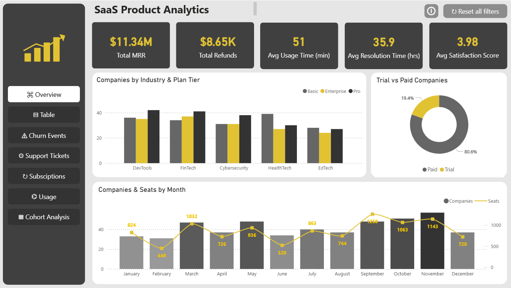
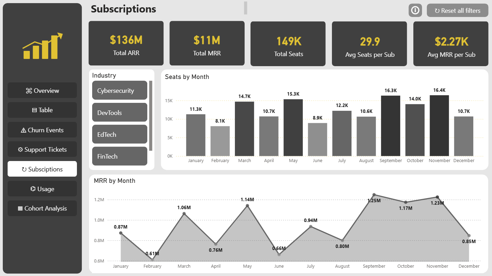
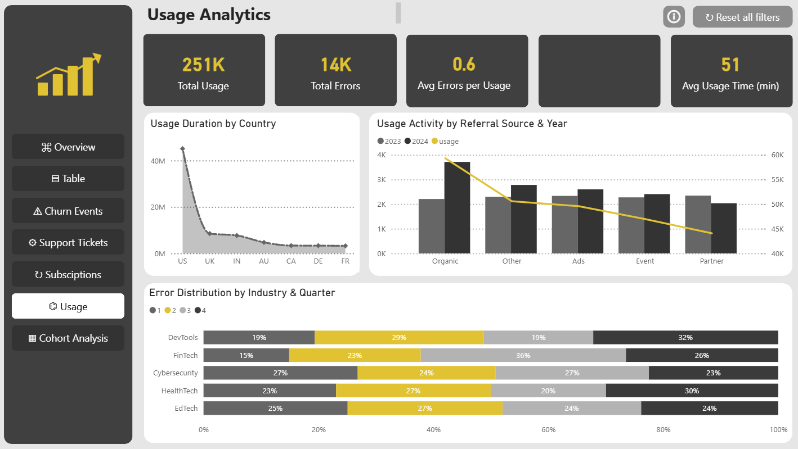
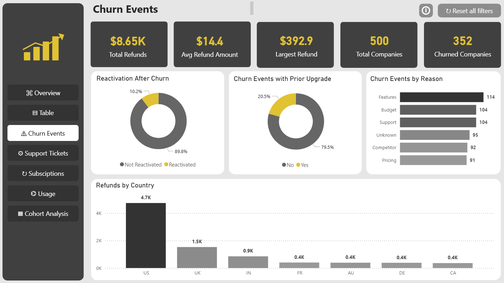
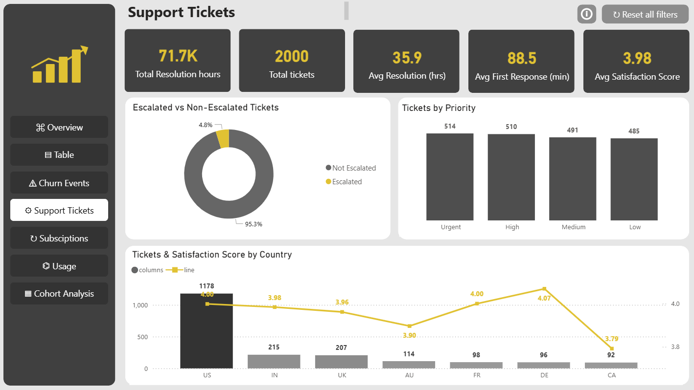
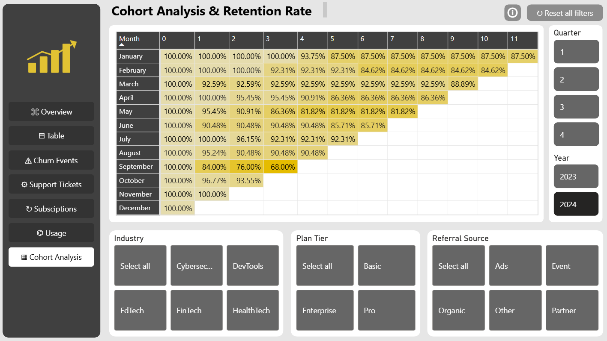
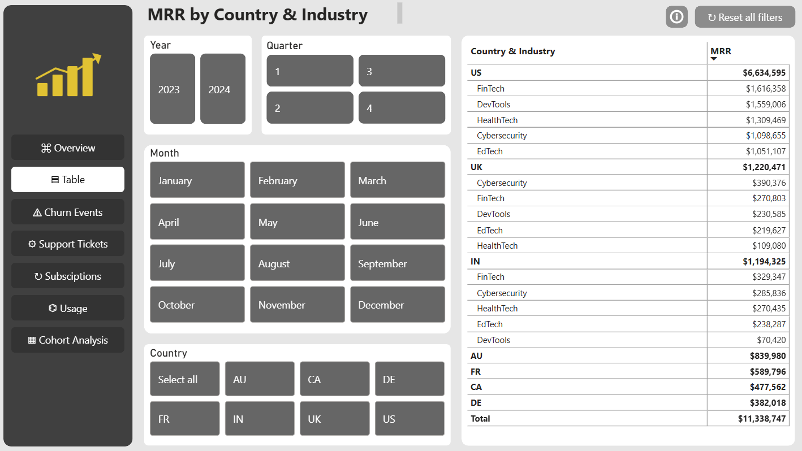
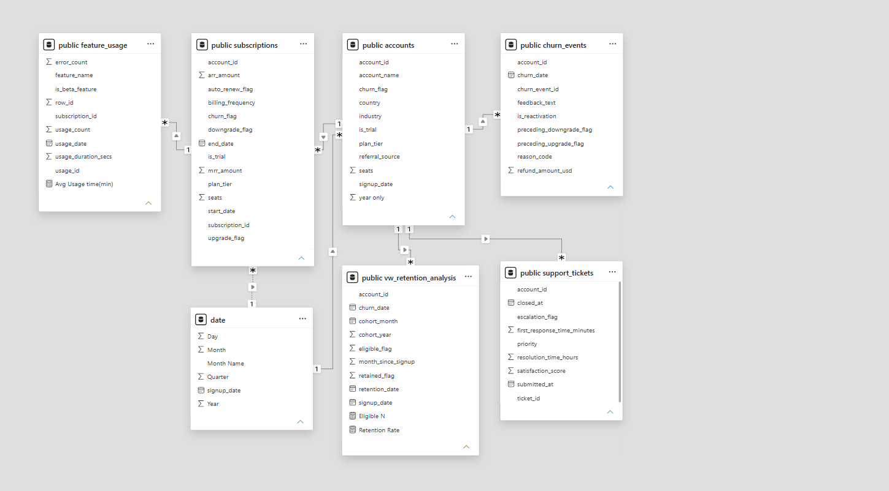

# 📊 RavenStack SaaS Analytics & Power BI Dashboard

### Dashboard Preview
[📊 Open ravenstack_dashboard.pbix](powerbi/ravenstack_dashboard.pbix)



## 📌 Project Overview

This project analyzes **RavenStack**, a fully synthetic multi-table SaaS dataset simulating a stealth-mode B2B software startup piloted with coding bootcamp graduates.

The goal of this project is to transform raw product, billing, and support data into meaningful churn and retention insights using **PostgreSQL, SQL, and Power BI**.

The analysis focuses on subscription revenue, feature adoption, support workload, churn drivers, and cohort-based retention behavior ahead of the product's public launch.

---

## 🎯 Business Objectives

- Analyze overall MRR/ARR and subscription performance
- Identify which customer segments (industry, plan tier, referral source) churn the most
- Understand feature adoption and beta-feature usage patterns
- Evaluate support ticket volume, resolution time, and satisfaction
- Measure churn timing and retention through cohort analysis
- Detect and resolve data quality issues before trusting any metric
- Build an interactive, filterable Power BI dashboard

---

## 🗂️ Dataset

The project uses the **RavenStack Synthetic SaaS Dataset**, a scripted, referentially-complete dataset covering signups from 2023–2024.

The dataset includes the following tables:

| Table | Description |
|---|---|
| `accounts` | Customer accounts, signup date, industry, plan tier, churn flag |
| `subscriptions` | Billing records per account — MRR/ARR, plan tier, upgrade/downgrade flags |
| `feature_usage` | Per-subscription usage events across 40 product features |
| `support_tickets` | Support tickets — priority, resolution time, satisfaction score |
| `churn_events` | Churn event log — reason code, refund amount, reactivation flag |

---

## 🛠️ Tools & Technologies

- **PostgreSQL** — Database management and SQL analysis
- **SQL** — Data cleaning, validation, view creation, and cohort logic
- **Power BI** — Interactive dashboard and data visualization
- **DAX** — Retention, churn-rate, and weighted-average measures
- **Power Query** — Data import and modeling
- **Python (pandas, scipy)** — Exploratory analysis and statistical validation
- **GitHub** — Project documentation and version control

---

## 🔄 Project Workflow

### 1. Data Import & Database Setup

The raw CSV files were imported into PostgreSQL and structured into five relational tables linked by `account_id` and `subscription_id`.

### 2. Data Quality Audit

The dataset was reviewed and several issues were identified before any metric was trusted:

- An embedded duplicate header row inside `subscriptions.csv`
- A mismatch between `accounts.churn_flag` and the `churn_events` log (277 accounts flagged as active despite having a churn event; 35 flagged churned with no matching event)
- A lag between `accounts.signup_date` and `subscriptions.start_date` that breaks naive monthly retention curves
- Small subgroup sample sizes that make several "obvious" churn patterns statistically insignificant

### 3. Data Cleaning & Transformation

SQL and Python were used to prepare the data for analysis, including:

- Removing malformed rows
- Reconciling `churn_flag` against `churn_events` to define a single "reliable churn" rule
- Building a snapshot-date-aware age calculation instead of relying on `CURRENT_DATE`
- Creating reusable cohort and retention views

### 4. Exploratory & Statistical Analysis

SQL and Python (pandas/scipy) were used to explore:

- Revenue and subscription performance
- Churn rate by industry, plan tier, referral source, and trial status
- Statistical significance (chi-square, Cramér's V) of subgroup churn differences
- First-3-month churn rate by signup cohort, adjusted for right-censoring
- Support ticket load and its (weak) relationship to churn

### 5. Data Modeling

Two SQL views power the retention analysis:

- `vw_cohort_account_base` — account-level base with cohort, age, and churn flags for slicing by industry/plan/referral source
- `vw_retention_analysis` — account × month grid used to build the classic cohort retention matrix

### 6. Dashboard Development

An interactive Power BI dashboard was built to explore subscriptions, feature usage, support load, churn events, and cohort retention through a shared filter model.

---

## 📊 Power BI Dashboard

### Dashboard Pages

| Page | Preview |
|---|---|
| **Overview** — top-line KPIs (MRR, refunds, usage, resolution time, satisfaction) |  |
| **Subscriptions** — MRR/ARR, plan tier, seats, billing frequency |  |
| **Usage** — feature adoption, beta-feature activity |  |
| **Churn Events** — reactivation, prior upgrades, refunds, reason codes |  |
| **Support Tickets** — resolution time, satisfaction, escalation |  |
| **Cohort Analysis & Retention Rate** — monthly cohort retention heatmap |  |
| **Table** — row-level detail for drill-through |  |

### Data Model



### Dashboard Features

- KPI cards for MRR, refunds, usage time, resolution time, and satisfaction
- Industry, plan tier, referral source, and quarter/month slicers
- Cohort retention matrix with a percentage-based heatmap
- Churn reason and reactivation breakdowns
- Drill-through to row-level account and ticket detail

---

## 📈 Key Business Questions

This project aims to answer the following questions:

1. What is the overall churn rate, and which segments drive it?
2. Do plan tier, industry, or referral source meaningfully predict churn — or is the apparent pattern statistical noise?
3. How does early (first 3 month) churn behave across signup cohorts over time?
4. How does subscription retention decay month-over-month within a cohort?
5. Is support ticket volume or resolution time actually correlated with churn?
6. Which churn reasons and refund patterns are most common?
7. Which features see the highest adoption, and how does beta-feature usage compare?

---

## 💡 Key Insights

- Overall account churn sits around **22%**, but plan tier shows almost no relationship to churn (Cramér's V ≈ 0.002) — pricing tier alone doesn't explain who leaves.
- Industry and referral-source differences in churn are directionally interesting but **not statistically significant** at conventional thresholds once tested with a chi-square test — a reminder not to over-interpret subgroup differences in small samples.
- Adjusting for cohort age (right-censoring), **first-3-month churn has been climbing steadily** across 2023–2024 signup cohorts, from roughly 4–5% up to double digits — a stronger and more actionable signal than overall churn rate.
- Support ticket volume, resolution time, and satisfaction show **little measurable difference** between churned and retained accounts in this dataset.
- Two underlying data-quality issues (a duplicate CSV header row and a `churn_flag` / `churn_events` mismatch) had to be resolved before any of the above could be trusted — a core reminder that dashboard polish matters far less than data integrity.

---

## 📁 Project Structure

```text
RavenStack SaaS Analytics/
│
├── Dataset/
│   ├── accounts.csv
│   ├── subscriptions.csv
│   ├── feature_usage.csv
│   ├── support_tickets.csv
│   └── churn_events.csv
│
├── assets/
│   ├── overview.png
│   ├── supscriptions.png
│   ├── usage.png
│   ├── churn_events.png
│   ├── support_tickets.png
│   ├── cohort_analysis.png
│   ├── table.png
│   └── model_view.png
│
├── powerbi/
│   └── ravenstack_dashboard.pbix
│
├── sql/
│   ├── 01_create_tables.sql
│   ├── 02_data_quality_audit.sql
│   ├── 03_vw_cohort_account_base.sql
│   ├── 04_vw_cohort_churn_3mo.sql
│   └── 05_vw_retention_analysis.sql
│
├── .gitignore
│
└── README.md
```

---

## 🙏 Credit

Dataset: **RavenStack Synthetic SaaS Dataset** by River @ Rivalytics — fully synthetic, no PII. Used here for educational and portfolio purposes with credit to the original author.
